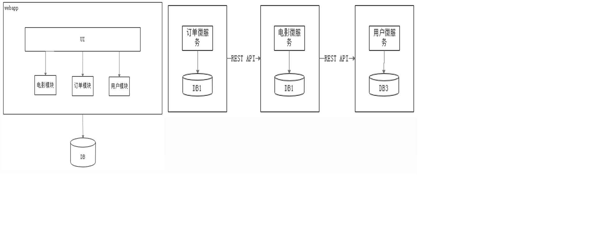
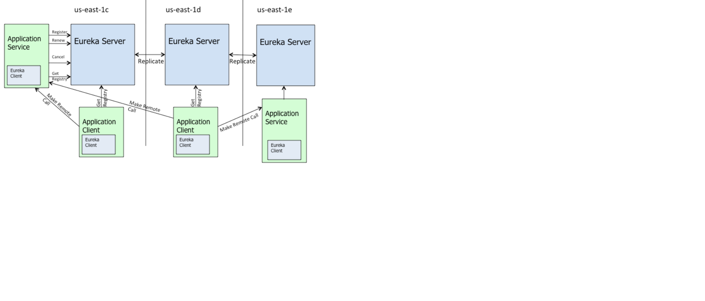

# springcloud

## 简单了解
### 什么是微服务
Martin Fowler：简而言之，微服务架构风格这种开发方法，是以开发一组小型服务的方式来开发一个独立的应用系统的。其中每个小型服务都运行在自己的进程中，并经常采用HTTP资源API这样轻量的机制来相互通信。这些服务围绕业务功能进行构建，并能通过全自动的部署机制来进行独立部署。这些微服务可以使用不同的语言来编写，并且可以使用不同的数据存储技术。对这些微服务我们仅做最低限度的集中管理。

### 单体架构和微服务架构

### 单体架构存在的缺点
* 复杂性逐渐变高
* 技术债务逐渐上升
* 部署速度逐渐变慢
* 阻碍技术创新
* 无法按需伸缩

### 微服务架构的优点和缺点

* 易于开发和维护               
* 启动较快
* 局部修改容易部署
* 技术栈不受限
* 按需伸缩
* DevOps
------------------------------------------------------------
* 运维要求较高
* 分布式的复杂性
* 接口调整成本高
* 重复劳动

### 微服务的设计原则
* 单一职责原则
* 服务自治原则
* 轻量级通信原则
* 接口明确原则

## 服务注册与发现

### eureka
#### eureka 简介
Eureka是Netflix开发的服务发现框架，本身是一个基于REST的服务，主要用于定位运行在AWS域中的中间层服务，以达到负载均衡和中间层服务故障转移的目的。Spring Cloud将它集成在其子项目spring-cloud-netflix中，以实现Spring Cloud的服务发现功能。

上图为Eureka官方wiki的架构图。Eureka Server：表示注册中心集群us-east-xxx：表示集群所在的区域Application Service：表示服务提供者Application Client：表示服务消费者Eureka Client：表示Eureka客户端

如图所示，现在有三个区us-east-1c,us-east-1d,us-east-1e，每个区里都有一个Eureka Server集群，以及不定的Application Service和Application Client。

由图可知，Eureka包含两个组件：Eureka Server 和 Eureka Client。
Eureka Server提供服务注册服务，各个节点启动后，会在Eureka Server中进行注册，这样Eureka Server中的服务注册表中将会存储所有可用服务节点的信息，服务节点的信息可以在界面中直观的看到。
Eureka Client是一个Java客户端，用于简化与Eureka Server的交互，客户端同时也具备一个内置的、使用轮询（round-robin）负载算法的负载均衡器。
在应用启动后，将会向Eureka Server发送心跳（默认周期为30秒）。如果Eureka Server在多个心跳周期内没有接收到某个节点的心跳，Eureka Server将会从服务注册表中把这个服务节点移除（默认90秒）。
Eureka Server之间将会通过复制的方式完成数据的同步。
Eureka还提供了客户端缓存的机制，即使所有的Eureka Server都挂掉，客户端依然可以利用缓存中的信息消费其他服务的API。
综上，Eureka通过心跳检测、健康检查、客户端缓存等机制，确保了系统的高可用性、灵活性和可伸缩性。

### consul
### zookeeper

### ribbon
#### ribbon简介
Ribbon是Netflix发布的云中间层服务开源项目，其主要功能是提供客户端侧负载均衡算法。Ribbon客户端组件提供一系列完善的配置项如连接超时，重试等。简单的说，Ribbon是一个客户端负载均衡器，我们可以在配置文件中列出Load Balancer后面所有的机器，Ribbon会自动的帮助你基于某种规则（如简单轮询，随机连接等）去连接这些机器，我们也很容易使用Ribbon实现自定义的负载均衡算法。
#### ribbon 针对微服务的个性化配置
##### 将个性化配置类不与application的默认包扫描路径写在一起
##### 利用自定义注解 @Interface生命个性化配置类，在启动类中利ExcludeFilters进行扫描过滤
##### 利用配置文件自定义RibbonClient

